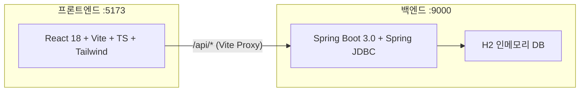
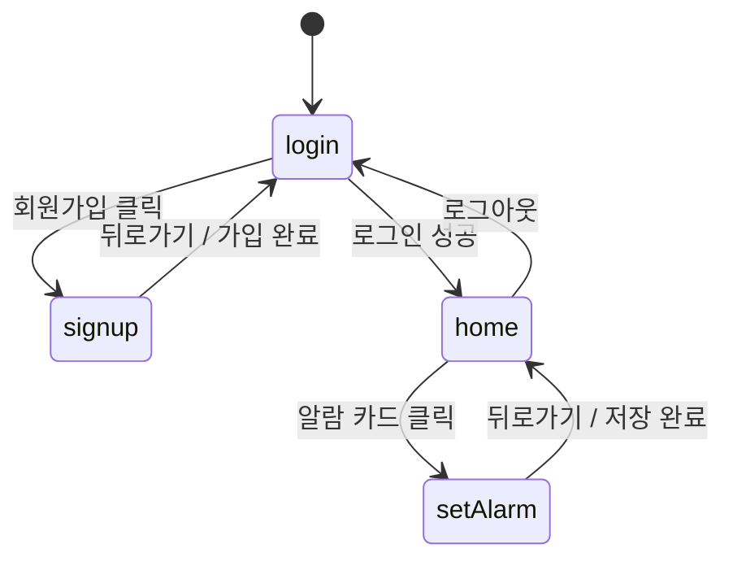
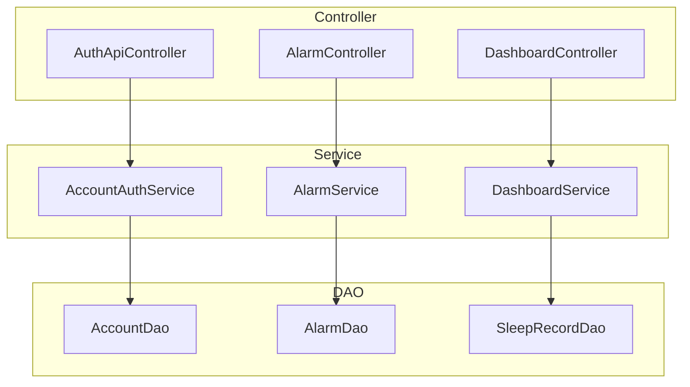
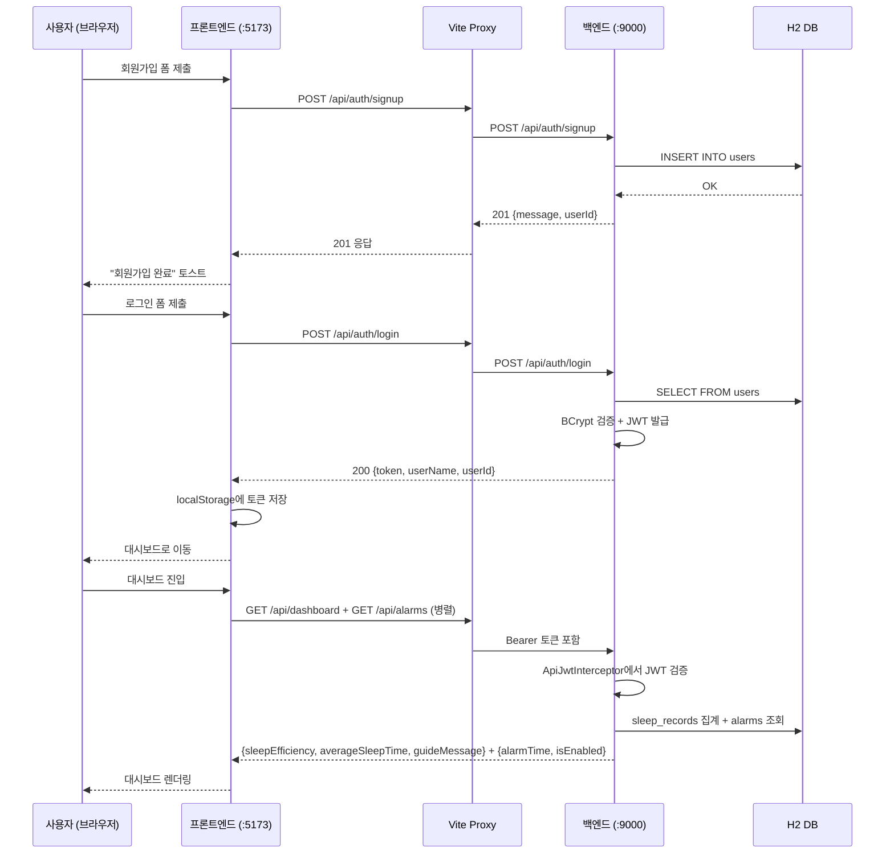

# SleepCare 프로젝트 종합 점검 보고서

> 점검일: 2026-04-27 | 대상: 프론트엔드 + 백엔드 전체 소스 (63개 Java 파일, 16개 프론트엔드 파일)
> **수정 반영일: 2026-04-27** — 필수 2건 + 권장 6건 코드 수정 완료

---

## 1. 전체 아키텍처 요약



| 구분 | 기술 | 상태 |
|---|---|:---:|
| 프론트엔드 | React 18 + Vite 5 + TypeScript + Tailwind CSS 3 | ✅ |
| 백엔드 | Spring Boot 3.0.6, Java 17, Gradle 8.9 | ✅ |
| 인증 | JWT (jjwt 0.11.2, HS256) | ✅ |
| DB | H2 인메모리 (개발) / MySQL (운영) | ✅ |
| 동시 실행 | `npm run dev` → concurrently로 두 서버 동시 기동 | ✅ |

---

## 2. 프론트엔드 상세 점검

### 2-1. 파일 구조

```
frontend/src/
├── App.tsx              # 라우팅 + 전역 상태 관리 (수동 state 기반)
├── main.tsx             # ReactDOM 엔트리
├── index.css            # Tailwind 디렉티브
├── api/
│   ├── client.ts        # fetch 래퍼, 토큰 관리, ApiError 클래스
│   ├── auth.ts          # signup / login
│   ├── alarm.ts         # getAlarm / upsertAlarm
│   └── dashboard.ts     # getDashboard
├── components/
│   ├── Button.tsx        # primary / secondary / outline 3종
│   ├── InputField.tsx    # 아이콘 지원 입력 필드
│   └── AlarmCard.tsx     # 알람 표시 카드
├── hooks/
│   └── useNotification.ts  # 토스트 알림 (3초 자동 닫힘)
├── layouts/
│   └── PageWrapper.tsx   # 공통 레이아웃 (헤더 + 배경 장식 + 토스트)
├── pages/
│   ├── LoginPage.tsx
│   ├── SignupPage.tsx
│   ├── HomePage.tsx      # 대시보드 (수면효율, 평균수면, 알람카드, 가이드)
│   └── SetAlarmPage.tsx  # 알람 시간 설정
└── types/
    └── index.ts          # PageName, ButtonProps 등 공유 타입
```

### 2-2. 라우팅 구조

> [!IMPORTANT]
> React Router를 사용하지 않고 `useState<PageName>` 기반의 수동 라우팅입니다. 현재 4페이지 규모에서는 문제없지만, 페이지가 늘어나면 React Router 도입을 권장합니다.



### 2-3. API 통신 구조

| 모듈 | 함수 | 엔드포인트 | 인증 |
|---|---|---|:---:|
| `auth.ts` | `signup(userId, password)` | `POST /api/auth/signup` | |
| `auth.ts` | `login(userId, password)` | `POST /api/auth/login` | |
| `alarm.ts` | `getAlarm()` | `GET /api/alarms` | ✅ |
| `alarm.ts` | `upsertAlarm(alarmTime)` | `POST /api/alarms` | ✅ |
| `dashboard.ts` | `getDashboard()` | `GET /api/dashboard` | ✅ |

**`client.ts` 동작 방식:**
- JWT 토큰은 `localStorage`에 `sleepCare.token` 키로 저장
- `auth: true` 옵션 시 `Authorization: Bearer <token>` 헤더 자동 첨부
- 에러 응답 시 `ApiError` 인스턴스 throw → 백엔드의 `errorCode`/`message` 자동 파싱

### 2-4. UI 점검 결과

| 항목 | 상태 | 비고 |
|---|:---:|---|
| 다크 모드 테마 | ✅ | `slate-950` 배경, 일관된 다크 디자인 |
| 반응형 레이아웃 | ⚠️ | `max-w-md mx-auto` — 모바일 중심, 데스크탑 대응은 최소 |
| 입력 검증 (FE) | ⚠️ | 빈 값 검사 + 비밀번호 일치만 체크, 패턴 검증은 백엔드에 의존 |
| 토스트 알림 | ✅ | `useNotification` 훅, 3초 자동 소멸 |
| 접근성 | ✅ | ~~`<input>` id 미설정~~ → `useId()` + `htmlFor` 연결 완료 |
| 알람 AM/PM 표시 | ✅ | ~~"AM" 하드코딩~~ → 시간 파싱 기반 동적 AM/PM 표시로 수정 완료 |
| 요일 선택 | ✅ | ~~로직 없음~~ → "추후 업데이트 예정" 안내 문구 추가, 뱃지 반투명 처리 |

### 2-5. 발견된 프론트엔드 이슈 → ✅ 수정 완료

> [!TIP]
> **AlarmCard.tsx** — ~~"AM" 하드코딩~~ → 시간 파싱 후 동적 AM/PM 표시로 수정 완료. 미설정 상태에서는 AM/PM 숨김.

> [!TIP]
> **SetAlarmPage.tsx** — 요일 뱃지에 "추후 업데이트 예정" 문구 추가, 평일 뱃지를 반투명 처리하여 비활성 상태 시각적 전달.

---

## 3. 백엔드 상세 점검

### 3-1. 계층 구조



### 3-2. 인증 체계

```
요청 → SecurityConfig (dev: permitAll) → ApiJwtInterceptor → @PreAuthorize 인자 주입 → Controller
```

| 구성요소 | 역할 |
|---|---|
| `SecurityConfig` | dev/local-h2: 모든 요청 permitAll, prod: 화이트리스트 외 authenticated |
| `ApiJwtInterceptor` | `/api/alarms/**`, `/api/dashboard/**`에 대해 JWT 검증 + userId 추출 |
| `JwtAuthHandlerArgumentResolver` | `@PreAuthorize long userId` 파라미터에 request attribute 주입 |
| `JwtTokenProvider` | HS256 서명, 토큰 생성/검증/principal 추출 |
| `JwtAuthenticationFilter` | prod 프로파일에서 Spring Security 필터 체인에 등록 |

> [!NOTE]
> dev 프로파일에서는 Spring Security가 `permitAll`이지만, `ApiJwtInterceptor`가 별도로 JWT를 검증하므로 **개발 중에도 실제 인증이 작동합니다**. 이는 의도된 설계입니다.

### 3-3. DB 스키마

| 테이블 | 용도 | 현재 사용 |
|---|---|:---:|
| `user` | 레거시 (email 기반) | ⚠️ 레거시 |
| `users` | 신규 (username 기반) | ✅ 활성 |
| `alarms` | 사용자별 알람 | ✅ 활성 |
| `sleep_records` | 수면 기록 | ⚠️ 테이블만 존재, 입력 API 없음 |
| `sleep_environments` | 환경 센서 데이터 | ⚠️ 테이블만 존재, 미사용 |
| `alarm_adjustments` | 적응형 알람 산출물 | ⚠️ 테이블만 존재, 미사용 |

### 3-4. API 엔드포인트 전체 목록

| Method | Path | 인증 | Controller | 상태 |
|---|---|:---:|---|:---:|
| POST | `/api/auth/signup` | | AuthApiController | ✅ |
| POST | `/api/auth/login` | | AuthApiController | ✅ |
| GET | `/api/alarms` | ✅ | AlarmController | ✅ |
| POST | `/api/alarms` | ✅ | AlarmController | ✅ |
| GET | `/api/dashboard` | ✅ | DashboardController | ✅ |
| — | `/api/sleep` | — | — | ❌ 미구현 |

### 3-5. 에러 처리

```
ApiException → ApiExceptionControllerAdvice → ApiErrorResponse (errorCode, message, timestamp)
MethodArgumentNotValidException → 필드별 메시지 조합
기타 Exception → SERVER_001 (500)
```

| 에러코드 | 메시지 | HTTP |
|---|---|---|
| AUTH_001 | 아이디/비밀번호 불일치 | 401 |
| AUTH_002 | 중복 아이디 | 409 |
| AUTH_003 | 인증 필요 | 401 |
| AUTH_004 | 유효하지 않은 토큰 | 401 |
| AUTH_005 | 만료된 토큰 | 401 |
| VALIDATION_001 | 입력값 오류 | 400 |
| ALARM_001 | 알람 미발견 | 404 |
| SERVER_001 | 서버 오류 | 500 |

### 3-6. 발견된 백엔드 이슈 → 부분 수정 완료

> [!WARNING]
> **레거시 코드 잔존**: `controller/AuthController.java`, `controller/UserController.java`, `service/AuthService.java`, `service/UserService.java`, `dao/UserDao.java`, `dto/auth/*`, `dto/user/*` 등 email 기반 레거시 코드가 그대로 남아 있습니다. 현재 프론트엔드와 연결되지 않아 동작에 영향은 없지만, 정리를 권장합니다.

> [!TIP]
> ✅ **DashboardService** — ~~`GUIDE_MESSAGE` 하드코딩~~ → 수면 데이터 유무 및 효율 수준별 동적 가이드 메시지 생성으로 수정 완료. `sleep_environments` 연동 시 확장 가능한 구조.

> [!TIP]
> ✅ **schema.sql** — `sleep_records`에 `UNIQUE(user_id, sleep_date)` 복합 제약 추가 완료.

---

## 4. 프론트-백엔드 연결 흐름 종합



**검증 결과**: 프론트엔드 API 모듈 ↔ Vite 프록시 ↔ 백엔드 컨트롤러 ↔ 서비스 ↔ DAO 간 **데이터 타입과 필드명이 모두 일치**합니다. 연결에 구조적 문제는 없습니다.

---

## 5. Fitbit 연동 준비 상태 평가

### 5-1. 현재 상태

| 준비 항목 | 상태 | 설명 |
|---|:---:|---|
| `sleep_records` 테이블 | ✅ | 스키마 존재, 필요한 컬럼 모두 포함 |
| `SleepRecordDao.aggregateRecent()` | ✅ | 7일 평균 집계 쿼리 구현 완료 |
| `DashboardService` → `SleepRecordDao` 연결 | ✅ | 데이터만 들어오면 자동 반영 |
| 수면 기록 입력 API (`/api/sleep`) | ❌ | **미구현** |
| `SleepRecordDao.insert()` | ❌ | **미구현** |
| Fitbit OAuth 연동 | ❌ | **미구현** |
| WebConfig 인터셉터 경로 | ⚠️ | `/api/sleep/**` 미등록 |

### 5-2. 바로 착수 가능한가?

> [!IMPORTANT]
> **예, 바로 착수 가능합니다.** 기존 문서 [fitbit-integration-guide.md](file:///c:/Users/jhsoo/Desktop/antigravity/sleepCare/docs/fitbit-integration-guide.md)에 구현 코드가 완비되어 있습니다.

**필요한 작업 (A안 — 모바일 앱 중계 방식 기준):**

| # | 작업 | 예상 난이도 | 예상 시간 |
|---|---|:---:|:---:|
| 1 | `SleepRecordRequest` / `SleepRecordResponse` DTO 생성 | 낮음 | 10분 |
| 2 | `SleepRecordDao`에 `insert()`, `findRecent()` 추가 | 낮음 | 15분 |
| 3 | `SleepRecordService` 생성 | 낮음 | 10분 |
| 4 | `SleepController` 생성 (POST/GET `/api/sleep`) | 낮음 | 10분 |
| 5 | `WebConfig`에 `/api/sleep/**` 인터셉터 경로 추가 | 매우 낮음 | 2분 |
| 6 | (권장) `schema.sql`에 UNIQUE 제약 추가 | 매우 낮음 | 2분 |
| **총합** | | | **~50분** |

### 5-3. 연동 후 검증 흐름

```bash
# 1. 회원가입 + 로그인으로 토큰 확보
TOKEN=$(curl -s -X POST http://localhost:9000/api/auth/login \
  -H "Content-Type: application/json" \
  -d '{"userId":"test123","password":"testpass1"}' | jq -r .token)

# 2. 수면 기록 입력
curl -X POST http://localhost:9000/api/sleep \
  -H "Authorization: Bearer $TOKEN" \
  -H "Content-Type: application/json" \
  -d '{"sleepDate":"2026-04-26","sleepStart":"2026-04-25T23:30:00",
       "sleepEnd":"2026-04-26T07:00:00","totalSleepMinutes":450,"sleepScore":88}'

# 3. 대시보드에서 값 확인 (88% / 7h 30m 예상)
curl -H "Authorization: Bearer $TOKEN" http://localhost:9000/api/dashboard
```

---

## 6. 종합 이슈 및 수정 결과

### 🔴 필수 수정 → ✅ 모두 완료

| # | 위치 | 이슈 | 조치 결과 |
|---|---|---|---|
| 1 | `AlarmCard.tsx` | ~~"AM" 하드코딩~~ | ✅ 시간 파싱 기반 동적 AM/PM 표시 |
| 2 | `schema.sql` | ~~UNIQUE 제약 없음~~ | ✅ `UNIQUE(user_id, sleep_date)` 추가 |

### 🟡 개선 권장 → 6건 완료, 2건 미착수

| # | 위치 | 이슈 | 조치 결과 |
|---|---|---|---|
| 3 | 레거시 코드 | 미사용 코드 잔존 | ⏳ 미착수 — 별도 정리 PR 필요 |
| 4 | `DashboardService` | ~~`GUIDE_MESSAGE` 하드코딩~~ | ✅ 수면 효율별 동적 메시지 생성 |
| 5 | 프론트엔드 | React Router 미사용 | ⏳ 미착수 — 페이지 확장 시 권장 |
| 6 | `index.html` | ~~`lang="en"`~~ | ✅ `lang="ko"` 로 변경 |
| 7 | `InputField.tsx` | ~~htmlFor 미연결~~ | ✅ `useId()` + `htmlFor` 연결 |
| 8 | `SetAlarmPage.tsx` | ~~요일 UI 로직 없음~~ | ✅ 안내 문구 추가 + 반투명 처리 |
| 9 | `JwtTokenProvider` | ~~JWT 키 로그 출력~~ | ✅ `log.info` 라인 삭제 |

### 🟢 잘 된 점

| 항목 | 평가 |
|---|---|
| 프론트-백엔드 API 타입 일치 | 모든 필드명/타입이 정확히 매칭 |
| 에러 처리 체계 | `ApiErrorCode` → `ApiException` → `ControllerAdvice` 일관된 구조 |
| JWT 인증 흐름 | 인터셉터 + ArgumentResolver 분리 설계 깔끔 |
| 크로스 플랫폼 실행 | `scripts/start-backend.js`로 OS 무관 실행 |
| 프로파일 분리 | local/local-h2/dev/prod 4단계 프로파일 |
| Vite 프록시 | `.env` 기반 API 타겟 변경 가능 |
| Fitbit 연동 가이드 | 가이드 문서 완성도 높음, 코드 예시 포함 |

---

## 7. 파일별 점검 체크리스트 (전체 요약)

### 프론트엔드 (16 파일)

| 파일 | 점검 | 이슈 |
|---|:---:|---|
| `App.tsx` | ✅ | 정상 — 상태 관리 + 라우팅 |
| `main.tsx` | ✅ | 정상 |
| `index.css` | ✅ | Tailwind 디렉티브만 포함 |
| `index.html` | ✅ | ~~`lang="en"`~~ → `lang="ko"` 수정 완료 |
| `vite.config.ts` | ✅ | 프록시 설정 정상 |
| `tailwind.config.js` | ✅ | content 경로 정상 |
| `postcss.config.js` | ✅ | 정상 |
| `api/client.ts` | ✅ | 토큰 관리 + 에러 처리 깔끔 |
| `api/auth.ts` | ✅ | signup/login 정상 |
| `api/alarm.ts` | ✅ | get/upsert 정상 |
| `api/dashboard.ts` | ✅ | 정상 |
| `components/Button.tsx` | ✅ | 3종 variant 정상 |
| `components/InputField.tsx` | ✅ | ~~htmlFor 미연결~~ → `useId` + `htmlFor` 수정 완료 |
| `components/AlarmCard.tsx` | ✅ | ~~AM 하드코딩~~ → 동적 AM/PM 수정 완료 |
| `layouts/PageWrapper.tsx` | ✅ | 배경 장식 + 토스트 정상 |
| `hooks/useNotification.ts` | ✅ | 정상 |
| `pages/LoginPage.tsx` | ✅ | 정상 |
| `pages/SignupPage.tsx` | ✅ | 자체 state 관리 정상 |
| `pages/HomePage.tsx` | ✅ | 병렬 API 호출 + cleanup 정상 |
| `pages/SetAlarmPage.tsx` | ✅ | ~~요일 UI 장식용~~ → 안내 문구 추가 |
| `types/index.ts` | ✅ | 정상 |

### 백엔드 (주요 30 파일)

| 파일 | 점검 | 이슈 |
|---|:---:|---|
| `SleepCareServerApplication.java` | ✅ | 정상 |
| `SecurityConfig.java` | ✅ | 프로파일별 분리 정상 |
| `WebConfig.java` | ✅ | 인터셉터 등록 정상 (sleep 추가 필요) |
| `AuthApiController.java` | ✅ | 정상 |
| `AlarmController.java` | ✅ | 정상 |
| `DashboardController.java` | ✅ | 정상 |
| `AccountAuthService.java` | ✅ | BCrypt + JWT 발급 정상 |
| `AlarmService.java` | ✅ | upsert 패턴 정상 |
| `DashboardService.java` | ✅ | ~~가이드 메시지 하드코딩~~ → 동적 메시지 생성 수정 완료 |
| `AccountDao.java` | ✅ | CRUD 정상 |
| `AlarmDao.java` | ✅ | 정상 |
| `SleepRecordDao.java` | ✅ | 집계만 존재, insert 필요 |
| `ApiJwtInterceptor.java` | ✅ | 정상 |
| `JwtAuthHandlerArgumentResolver.java` | ✅ | 정상 |
| `ApiErrorCode.java` | ✅ | 7종 에러코드 정상 |
| `ApiExceptionControllerAdvice.java` | ✅ | 3계층 핸들링 정상 |
| `ApiErrorResponse.java` | ✅ | 정상 |
| `JwtTokenProvider.java` | ✅ | ~~키 로그 출력~~ → 삭제 완료 |
| `JwtAuthenticationFilter.java` | ✅ | 정상 |
| `schema.sql` | ✅ | ~~UNIQUE 제약 부재~~ → 추가 완료 |
| `application.yml` | ✅ | 4 프로파일 정상 |
| 레거시 코드 (10여 개) | ⚠️ | 미사용, 정리 권장 |

---

## 8. 결론

1. **현재 구현된 기능(회원가입, 로그인, 알람 설정, 대시보드)은 프론트-백엔드 간 정상적으로 연결**되어 있으며 구조적 결함은 없습니다.
2. **Fitbit 연동은 바로 착수 가능**합니다. `fitbit-integration-guide.md`의 A안(모바일 앱 중계) 기준으로 약 50분이면 기본 연동이 완성됩니다. 핵심은 `SleepController` + `SleepRecordDao.insert()` 추가뿐이며, 대시보드는 자동으로 살아납니다.
3. 🔴 필수 수정 **2건 모두 완료**, 🟡 개선 권장 **6건 완료** / 2건(레거시 코드 정리, React Router 도입)은 별도 작업으로 남겨둠.

### 이번 수정에서 변경된 파일 목록

| 파일 | 변경 내용 |
|---|---|
| `frontend/src/components/AlarmCard.tsx` | AM/PM 동적 표시 |
| `frontend/src/components/InputField.tsx` | `useId()` + `htmlFor` 접근성 |
| `frontend/src/pages/SetAlarmPage.tsx` | 요일 안내 문구 + 반투명 처리 |
| `frontend/index.html` | `lang="ko"` |
| `spring-server/.../DashboardService.java` | 동적 가이드 메시지 |
| `spring-server/.../JwtTokenProvider.java` | JWT 키 로그 삭제 |
| `spring-server/.../schema.sql` | UNIQUE 제약 추가 |
